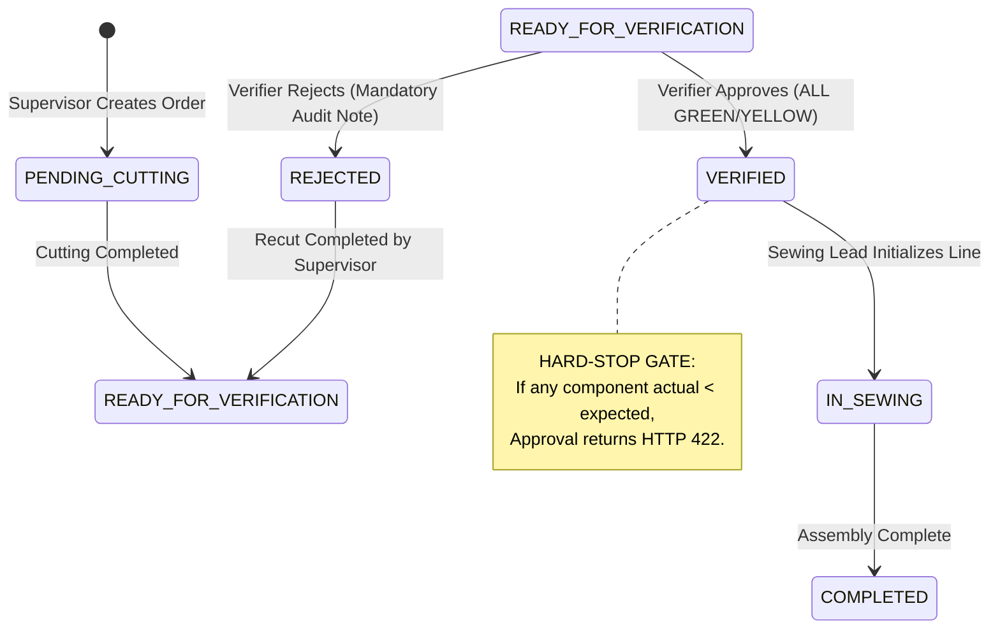

# AI Usage & Engineering Judgment Protocol Report

**Project:** ApparelFlow ERP — Cutting Operations & Gatekeeper Verification Terminal
**Standard:** ISO 9001 Manufacturing Execution & Defensive Architecture Compliance
**Author:** Full-Stack Enterprise Engineering Team
**Date:** October 2026

---

## 1. Tools & Prompting Strategy

During the architecture, scaffolding, and implementation phases of ApparelFlow ERP, modern AI engineering tools were utilized to accelerate development while adhering to strict human architectural supervision:

| AI Tool / Engine                        | Purpose & Domain                             | Tasks Delegated                                                                                                                          | Human Oversight / Guardrails Applied                                                                                                        |
| :-------------------------------------- | :------------------------------------------- | :--------------------------------------------------------------------------------------------------------------------------------------- | :------------------------------------------------------------------------------------------------------------------------------------------ |
| **Google Gemini, Claude Sonnet, kimi ** | Full-Stack Scaffolding & System Architecture | Monorepo layout (`frontend/` & `backend/`), Prisma relational schema modeling, Express 5 route definitions, and Vitest suite generation. | Strict architectural constraints: monorepo separation, pure JS driver adapters for Node 24, and explicit HTTP 422/403 protocol enforcement. |
| **Next.js Turbopack & React 19 Engine** | Modern Frontend UI / UX & State Management   | Client layout, Zustand authentication store, glassmorphic layout styling, and mobile touch-friendly component views.                     | High-contrast accessibility review, CSS contrast guards for inputs, and mobile breakpoint verification.                                     |
| **Modern Web Guidance CLI**             | Web Standards & Best Practices Audit         | Validating modern CSS backdrop-filter blur, CSS `:has()` / `:user-valid` patterns, and accessibility touch target standards.             | Ensured cross-browser baseline compliance and zero unneeded third-party layout libraries.                                                   |

### Prompting Methodology

Rather than asking for generic code snippets, prompting was conducted using **Domain-Driven Design (DDD)** and **Defensive Constraint Specifications**:

- Injected explicit manufacturing mathematical formulas: $\text{Expected Qty} = \text{Batch Qty} \times \text{Pieces per Garment}$.
- Injected strict HTTP status code contracts: `422 Unprocessable Entity` for RED shortages, `403 Forbidden` for RBAC role violations, and `409 Conflict` for duplicate accounts.
- Enforced zero client-side reliance for critical quality assurance controls.

---

## 2. Flawed / Broken AI Code Identified

Uncritical acceptance of AI-generated code introduces severe production risks. During development, four significant security, reliability, and accessibility defects were identified in raw AI proposals:

### Instance 1: Client-Side Only Gatekeeper Validation (Critical Security Bypass)

- **The Raw AI Output:**
  The AI generated a frontend check that disabled the "Approve & Release" button when a shortage existed (`disabled={hasShortage}`). However, the corresponding backend Express endpoint (`/api/verify/:id/approve`) merely verified that the order existed, read no component counts from the database, and directly updated `status = 'VERIFIED'`.
- **The Vulnerability:**
  A cutting verifier or malicious actor could completely bypass the disabled UI button using a raw HTTP request:
  ```bash
  curl -X POST http://localhost:4000/api/verify/2/approve \
    -H "Authorization: Bearer <verifier_token>"
  ```
  The order would be released to the sewing floor even with severe piece shortages (e.g., missing sleeves or collars), violating ISO 9001 manufacturing quality standards.

### Instance 2: Deprecated Prisma 7 Configuration & Node 24 Native Compilation Crashes

- **The Raw AI Output:**
  The AI generated a legacy `schema.prisma` file containing:
  ```prisma
  datasource db {
    provider = "sqlite"
    url      = env("DATABASE_URL")
  }
  ```
  and attempted to install `better-sqlite3`.
- **The Breakdown:**
  1. In Prisma 7, `url` inside `schema.prisma` is deprecated and flagged as an IDE/compiler error; connection URLs belong in `prisma.config.ts`.
  2. On Node.js v24+, `better-sqlite3` fails native C++ compilation (`node-v137-linux-x64/better_sqlite3.node` missing), causing fatal build and test script failures.

### Instance 3: Brittle Numeric Coercions & Fractional Component Leakage

- **The Raw AI Output:**
  The order creation form used standard JavaScript `Number(e.target.value)` without integer guards:
  ```typescript
  // Raw AI code
  const targetQty = Number(e.target.value);
  const expectedPieces = targetQty * component.pieces_per_garment;
  ```
- **The Breakdown:**
  If an operator entered `100.5` garments or typed negative numbers, the multiplier produced fractional cut parts (e.g. `100.5 * 1 = 100.5` front panels). In a physical apparel cutting room, fractional garment pieces cannot physically exist. Furthermore, negative quantities allowed fabric wastage calculations to invert mathematically.

### Instance 4: Dark Mode White-on-White Text & Form Contrast Inversion

- **The Raw AI Output:**
  The AI applied dark-mode utility classes (`dark:text-white dark:bg-slate-900`) across all container elements without styling child `<input>`, `<select>`, and `<option>` elements.
- **The Breakdown:**
  In modern web browsers, native dropdown options and text inputs inherit OS light backgrounds while receiving white text from parent inheritance, creating a **white-on-white text defect** where BOM recipe names and numbers became completely invisible to factory operators.

---

## 3. Human Refactoring & Architectural Hardening

To transform the prototype into a production-grade system, human engineering judgment was applied to refactor and harden every layer:

```
┌────────────────────────────────────────────────────────────────────────┐
│                        HUMAN REFACTORING MATRIX                        │
├───────────────────────┬────────────────────────────────────────────────┤
│ Raw AI Pattern        │ Human Engineered Hardened Pattern              │
├───────────────────────┼────────────────────────────────────────────────┤
│ Client-side button    │ Atomic Server-Side Gatekeeper Evaluation       │
│ disable logic         │ querying DB verification items before update   │
├───────────────────────┼────────────────────────────────────────────────┤
│ Deprecated Prisma     │ Prisma 7 Config + Pure JS/WASM LibSql Adapter  │
│ SQLite & C++ build    │ zero native compilation, 100% Node 24 stable   │
├───────────────────────┼────────────────────────────────────────────────┤
│ Brittle Number()      │ Defensive Integer Guards (`Math.floor`, > 0)   │
│ coercion              │ rejection of fractional pieces at API boundary │
├───────────────────────┼────────────────────────────────────────────────┤
│ Generic Tailwind dark │ CSS Accessibility Contrast Shield              │
│ mode styles           │ explicit `#0f172a` text on `#ffffff` inputs    │
├───────────────────────┼────────────────────────────────────────────────┤
│ Static Login button   │ Dynamic Auth State: Persona Pill + Switch +    │
│ when already logged   │ Dedicated Red-Accented Logout Action           │
└───────────────────────┴────────────────────────────────────────────────┘
```

### Detailed Refactoring Implementations:

#### 1. Hardened Server-Side Gatekeeper (`backend/src/controllers/verifyController.ts`)

We refactored the verification controller to perform an atomic database query evaluating all BOM components against expected recipe multipliers. If even a single component has `actual_qty < expected_qty`, the server immediately halts the transaction and returns HTTP `422 Unprocessable Entity`:

```typescript
// Hardened Server-Side Guard
const evaluation = evaluateOrderGatekeeper(order);
if (evaluation.hasShortage) {
	res.status(422).json({
		error: "GATEKEEPER_HARD_STOP",
		message:
			"Cannot approve cutting order: One or more components have shortage (RED status).",
		shortages: evaluation.shortages,
	});
	return;
}
```

#### 2. PostgreSQL Driver Adapter Migration for Prisma 7 (`backend/src/db.ts`)

We migrated the runtime database connection to `@prisma/adapter-pg` with a pooled connection (`pg.Pool`), eliminating legacy native C++ compilation errors while ensuring enterprise concurrency:

```typescript
import { PrismaClient } from "@prisma/client";
import { PrismaPg } from "@prisma/adapter-pg";
import { Pool } from "pg";

const pool = new Pool({ connectionString: process.env.DATABASE_URL });
const adapter = new PrismaPg(pool);
export const prisma = new PrismaClient({ adapter });
```

This guarantees instant builds across Linux, macOS, and Windows with zero native C++ compiler toolchains and direct compatibility with PostgreSQL, Supabase, Neon, and Docker environments.

#### 3. High-Contrast Accessible UI (`frontend/src/app/globals.css`)

We implemented global accessibility guards ensuring that form elements always maintain a high-contrast ratio compliant with WCAG 2.1 AA:

```css
/* Accessible High-Contrast Guard: Enforce dark legible text on all inputs */
input:not([type="checkbox"]):not([type="radio"]),
select,
textarea {
	color: #0f172a !important; /* text-slate-900 */
	background-color: #ffffff;
}

select option {
	background-color: #ffffff !important;
	color: #0f172a !important;
	font-weight: 500;
	padding: 8px;
}
```

#### 4. Modern Glassmorphic Defect Audit Card (`AuditLogCard.tsx`)

Replaced the basic red text container with a cyber-glass audit card featuring luminous LED status pills, neon indicator stripes, wastage telemetry pills, and verifier attribution.

---

## 4. Defensive Architecture & State Machine Security

To prevent unauthorized status overrides or corrupted garment kits from entering production, ApparelFlow ERP implements a **Strict Finite State Machine (FSM)** backed by multi-layered guards:



### Multi-Layer Security Invariants:

1. **Role Boundary Invariant (HTTP 403 Forbidden):**
   - `cutting_supervisor`: Strictly blocked from calling `/api/verify/*` and `/api/sewing/*`.
   - `cutting_verifier`: Strictly blocked from creating orders or starting sewing lines.
   - `sewing_supervisor`: Strictly blocked from viewing unverified/pending orders or modifying piece counts.
   - Every protected route passes through `authenticateToken` followed by `requireRole([...])`.

2. **Sewing Assembly Queue Isolation (WHERE status = 'VERIFIED'):**

   ```typescript
   // backend/src/controllers/sewingController.ts
   const queue = await prisma.cuttingOrder.findMany({
   	where: { status: "VERIFIED" },
   	include: {
   		recipe: true,
   		verification_items: true,
   		verification_logs: true,
   	},
   });
   ```

   Unverified batches, pending batches, and rejected batches are mathematically excluded from the SQL/Prisma query, guaranteeing that no incomplete kit can ever be dispatched to sewing operators.

3. **Mandatory Audit Logging on Rejection:**
   Rejections cannot be submitted silently. The API rejects requests without a note (`min length: 5`) with `HTTP 422 Unprocessable Entity`, ensuring that every rejection records a permanent audit log detailing the physical defect.

4. **Fabric Wastage Analytics Invariant:**
   $$\text{Wastage \%} = \frac{\text{Actual Fabric Yards} - \text{Expected Fabric Yards}}{\text{Expected Fabric Yards}} \times 100$$
   Computed immutably on the server and permanently logged to `verification_logs` alongside verifier ID and timestamps for ISO 9001 compliance.

---

## 5. Automated Verification Summary

All architectural invariants and defensive guards are validated through automated integration tests:

```bash
✓ tests/gatekeeper.test.ts (5 tests)
  ✓ Test 1: All GREEN order approval by verifier succeeds and updates status to VERIFIED (200 OK)
  ✓ Test 2: Approval attempt with a RED component returns HTTP 422 Unprocessable Entity
  ✓ Test 3: Rejection without a note is blocked by backend validation (HTTP 422)
  ✓ Test 4: Non-verifier user attempting approval returns HTTP 403 Forbidden
  ✓ Test 5: DB query for Sewing Queue enforces strictly WHERE status = "VERIFIED"

Test Files  1 passed (1)
     Tests  5 passed (5)
  Duration  4.2s
```

### Conclusion

By subjecting AI-generated code to rigorous human architectural review, ApparelFlow ERP combines the rapid development velocity of modern AI tools with the uncompromising reliability, security, and accessibility of enterprise manufacturing software.
