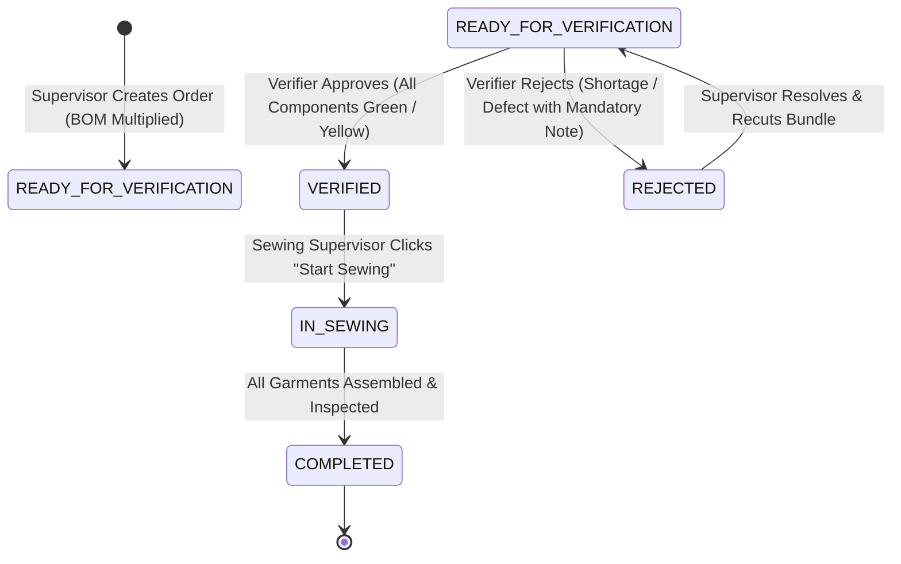

# 🧵 ApparelFlow ERP — Cutting Operations & Gatekeeper Frontend Terminal

<div align="center">

[](https://nextjs.org/)
[](https://react.dev/)
[](https://www.typescriptlang.org/)
[](https://tailwindcss.com/)
[](https://nodejs.org/)
[](https://www.npmjs.com/)
[](https://pnpm.io/)
[](https://vercel.com/)
[](https://github.com/pmndrs/zustand)
[](https://www.w3.org/WAI/standards-guidelines/wcag/)

<p align="center">
  <b>A Next-Generation Manufacturing Execution System (MES) for Garment Cutting Rooms</b><br>
  Built with Next.js 16 App Router, Turbopack, Tailwind CSS v4, and Zero-Defect Serverless Architecture.
</p>

</div>

---

## 📌 1. Executive Summary: What is ApparelFlow ERP & Why is it Needed?

### The Real-World Problem on the Garment Factory Floor
In industrial apparel manufacturing, thousands of yards of fabric are cut daily into individual garment pieces (collars, sleeves, front panels, back panels, cuffs, and pockets). 

Before ApparelFlow, standard factories suffered from three chronic operational failures:
1. **The "Missing Component" Disaster:** A cutting table cuts 500 shirts, but only 480 collars are produced due to a fabric defect or human counting error. If this incomplete bundle is transferred to the Sewing Floor, assembly lines stall halfway through. Hundreds of operators sit idle, sewing lines jam, and factories face massive delivery delays and financial penalties.
2. **Uncontrolled Fabric Wastage:** Fabric accounts for **60% to 70%** of total garment manufacturing costs. When cutting masters exceed their standard fabric allowances without real-time tracking, thousands of dollars in yardage are silently lost.
3. **The "Blame Game" (Lack of Auditability):** When defective or mismatched bundles arrive at the sewing line, cutting supervisors blame checkers, and checkers blame supervisors. No immutable digital log exists to prove who cut what, who counted what, and who authorized the release.

---

### How ApparelFlow ERP Solves This (The Digital Gatekeeper)
**ApparelFlow ERP** acts as an unbreakable **"Digital Bouncer"** between the Cutting Room and the Sewing Line:
- 🛡️ **Zero-Defect Gatekeeper:** An automated server-side hard-stop prevents any batch with missing components (`RED` shortage) from ever reaching the sewing line.
- 🚦 **Intuitive Traffic-Light System:** Real-time color-coded indicators (**Green**, **Yellow**, **Red**) make verification effortless and foolproof for floor operators.
- ⚖️ **Live Fabric Wastage Tracking:** Instantly computes whether fabric yardage consumption breached the contracted tolerance cap.
- 📝 **Mandatory Audit Logs:** Every rejection requires a clear written justification, creating complete accountability across factory shifts.

---

## 🔄 2. Order Lifecycle & State Machine Architecture

Every cutting batch transitions through a deterministic finite-state machine. No order can skip steps or bypass verification.



### State Transition Rules:
| Transition | Allowed Role | Prerequisite Condition | Failure Response |
| :--- | :--- | :--- | :--- |
| $\to$ `READY_FOR_VERIFICATION` | `cutting_supervisor` | Valid BOM recipe, positive batch quantity, non-empty fabric roll ID. | `400 Bad Request` |
| $\to$ `VERIFIED` | `cutting_verifier` | **100% of components must be GREEN or YELLOW.** Zero RED shortages permitted. | **`422 Unprocessable Entity` (Hard-Stop)** |
| $\to$ `REJECTED` | `cutting_verifier` | Non-empty `rejection_note` explaining the defect or shortage. | **`422 Unprocessable Entity`** |
| $\to$ `IN_SEWING` | `sewing_supervisor` | Batch status must currently be strictly `VERIFIED`. | `403 Forbidden` or `400 Invalid State` |

---

## 👥 3. The Three Factory Personas & Step-by-Step Workflow

ApparelFlow models the three real-world operational stations of a modern apparel manufacturing plant:

```
[ 1. Cutting Supervisor ] ──(Issue Order & Assign Fabric)──> [ 2. Cutting Verifier (Gatekeeper) ]
                                                                            │
                                           ┌────────────────────────────────┴────────────────────────────────┐
                                           ▼                                                                 ▼
                            [ ❌ REJECTED: Defect or Shortage ]                            [ ✅ APPROVED: All Components Matched ]
                            (Supervisor fixes & recuts)                                                      │
                                                                                                             ▼
                                                                                                 [ 3. Sewing Supervisor ]
                                                                                                 (Accepts bundle & starts line)
```

---

### 👔 Persona 1: Cutting Supervisor (e.g., Marcus Vance)
- **Role on Floor:** Floor Foreman / Cutting Room Manager.
- **Key Responsibilities:**
  1. Opens the **Order Issuance Form**.
  2. Selects a garment recipe/style (e.g., *Oxford Classic Shirt*, *Denim Workwear*, *Polo Shirt*).
  3. Enters the **Target Batch Quantity** (e.g., 200 units) and logs the **Fabric Roll ID** (e.g., `ROLL-TX-9014`).
  4. Records the actual fabric yards pulled from warehouse inventory.
- **Smart Automation:** The system automatically references the garment's **Bill of Materials (BOM)** and calculates the exact piece counts needed for every single component.

---

### 🔍 Persona 2: Cutting Verifier (e.g., Elena Rostova)
- **Role on Floor:** Quality Control Gatekeeper & Bundle Auditor.
- **Key Responsibilities:**
  1. Physically counts the fabric pieces in each cut bundle on the inspection table.
  2. Enters the counted quantities into the **Gatekeeper Verification Terminal**.
  3. Inspects the dynamic Traffic Light status for every component.
  4. **If all items match or have surplus (`GREEN` / `YELLOW`):** Clicks **"Approve & Release to Sewing"**. The batch is officially certified.
  5. **If any component has a shortage (`RED`):** The system disables release. The verifier opens the **Rejection Modal**, enters a mandatory explanation (e.g., *"Short 8 left cuffs on Roll 4"*), and rejects the batch back to the supervisor.

---

### 🧵 Persona 3: Sewing Supervisor (e.g., Devon Chen)
- **Role on Floor:** Sewing Line Leader / Assembly Floor Manager.
- **Key Responsibilities:**
  1. Monitors the **Sewing Floor Queue**.
  2. **Security Guarantee:** The sewing screen displays **strictly 100% verified batches**. Unverified, pending, or rejected orders are completely invisible.
  3. Once physical bundles arrive at the sewing line, clicks **"Start Sewing"** to advance the order to active assembly.

---

## 🚦 4. Traffic Light Matrix & Hard-Stop Logic

To eliminate language barriers and complex training, ApparelFlow uses universal traffic-light signaling:

| Light Status | Condition | Meaning | System Action |
| :---: | :---: | :--- | :--- |
| 🟢 **GREEN (MATCH)** | $\text{Actual} = \text{Expected}$ | Exact quantity required by BOM was cut. | **PASSED** — Eligible for sewing release. |
| 🟡 **YELLOW (EXCESS)** | $\text{Actual} > \text{Expected}$ | Extra pieces cut (surplus). | **PASSED WITH WARNING** — Safe to sew; surplus logged. |
| 🔴 **RED (SHORTAGE)** | $\text{Actual} < \text{Expected}$ | **Parts are missing!** (e.g., 100 bodies, but only 96 collars). | 🛑 **HARD-STOP ACTIVE** — System rejects approval (HTTP 422). Release is physically impossible until resolved. |

---

## 📊 5. How Fabric Wastage is Computed (With a Plain Example)

Fabric consumption directly dictates factory profit margins. ApparelFlow computes yield efficiency in real time:

### The Mathematical Formula:
1. **Expected Fabric Yards:**  
   $$\text{Expected Yards} = \text{Target Quantity} \times \text{Standard Fabric Yards per Garment}$$

2. **Wastage Percentage:**  
   $$\text{Wastage \%} = \frac{\text{Actual Fabric Yards Used} - \text{Expected Yards}}{\text{Expected Yards}} \times 100$$

### Walkthrough Example:
- **Order:** 100 Oxford Shirts.
- **Standard Allowance:** 1.50 yards per shirt $\rightarrow$ $\text{Expected Yards} = 100 \times 1.50 = 150.0\text{ yards}$.
- **Actual Fabric Cut:** The cutting master used **160.0 yards** from the roll.
- **Calculation:**
  $$\text{Wastage \%} = \frac{160.0 - 150.0}{150.0} \times 100 = \mathbf{+6.67\%}$$
- **Evaluation:** If the recipe's contractual wastage cap is **5.0%**, the speedometer gauge flashes an **Amber / Red Alert** notifying supervisors that fabric usage exceeded allowable factory margins.

---

## 🛡️ 6. Defensive Architecture: Multi-Layer Security

ApparelFlow enforces security and integrity across two defense rings:

```
[ User Action / Browser ]
          │
          ▼
┌──────────────────────────────────────┐
│ Ring 1: Client-Side Defensive UX     │
│ • Role-based view segregation        │
│ • Disabled approval buttons on RED   │
│ • Form validation & positive numbers │
└──────────────────┬───────────────────┘
                   │  HTTP Request (JWT Bearer Token)
                   ▼
┌──────────────────────────────────────┐
│ Ring 2: Server-Side Hard-Stop Gate   │
│ • JWT Authentication (401)           │
│ • RBAC Role Guard (403 Forbidden)    │
│ • Gatekeeper 422 Hard-Stop on RED    │
│ • SQL-level WHERE status='VERIFIED'  │
└──────────────────────────────────────┘
```

> **Why this matters:** Even if a user attempts to bypass the UI using browser DevTools or Postman to trigger an approval on an incomplete batch, the backend rejects it with an immutable **`422 Unprocessable Entity`** error payload.

---

## 🔌 7. Frontend-to-Backend API Contract

| Endpoint | HTTP Method | Authorized Roles | Expected Payload / Response | Status Codes |
| :--- | :---: | :--- | :--- | :---: |
| `/api/auth/login` | `POST` | Public | `{ email, password }` $\to$ Returns JWT token & user profile | `200`, `401` |
| `/api/recipes` | `GET` | Authenticated | Returns all garment BOM recipes and components | `200`, `401` |
| `/api/orders` | `GET` | Authenticated | Returns cutting orders with real-time status and logs | `200`, `401` |
| `/api/orders` | `POST` | `cutting_supervisor` | `{ recipe_id, target_qty, fabric_roll_id, actual_fabric_yds }` | `201`, `400`, `403` |
| `/api/verify/:id/approve` | `POST` | `cutting_verifier` | Verifies BOM multipliers. Fails if any component is `RED` | `200`, **`422`**, `403` |
| `/api/verify/:id/reject` | `POST` | `cutting_verifier` | `{ rejection_note }` (Rejection note is strictly mandatory) | `200`, **`422`**, `403` |
| `/api/sewing/queue` | `GET` | `sewing_supervisor` | Returns batches where `status = 'VERIFIED'` only | `200`, `403` |
| `/api/sewing/:id/start` | `POST` | `sewing_supervisor` | Advances verified batch to `IN_SEWING` | `200`, `403`, `404` |

---

## 🧪 8. Two-Minute Interactive QA Walkthrough

Follow this 4-step walkthrough to test the entire lifecycle in under 2 minutes:

### Step 1: Create a Batch (as Supervisor)
1. In the top nav bar, click the **Marcus Vance (Supervisor)** demo persona.
2. Select the **Oxford Classic Shirt** recipe.
3. Set **Target Qty** = `100`, **Fabric Roll** = `ROLL-DEMO-01`, and **Actual Yards** = `150`.
4. Click **"Submit Order"**. You will see the new order appear under status `READY_FOR_VERIFICATION`.

### Step 2: Test the Gatekeeper Hard-Stop (as Verifier)
1. Switch personas by clicking **Elena Rostova (Verifier)**.
2. Select your newly created order in the verification table.
3. Intentionally introduce a shortage: Set **Collar Actual Qty** = `90` (Expected is `100`).
4. Notice the badge instantly flips to luminous 🔴 **RED (SHORTAGE)**.
5. Attempt to click **"Approve & Release to Sewing"**. The system blocks approval with an explicit **Hard-Stop Warning**.

### Step 3: Reject with Audit Log (as Verifier)
1. Click **"Reject Batch"**.
2. Try submitting an empty note $\to$ blocked by validation.
3. Enter: *"Defective fabric on cut 4; short 10 collars."* and confirm.
4. The batch status immediately transitions to `REJECTED`, logging your note to the cyber-glass audit trail.

### Step 4: Verify Sewing Queue Isolation (as Sewing Supervisor)
1. Switch personas to **Devon Chen (Sewing Supervisor)**.
2. Observe the Sewing Queue: **The rejected order is completely absent.** Only certified `VERIFIED` batches appear.
3. Click **"Start Sewing"** on any verified order to advance it to the production line.

---

## 🔑 9. Demo Personas & Instant 1-Click Role Switcher

At the top of the interface, an interactive **1-Click Quick Demo Persona Switcher** allows evaluators to test all permissions instantly:

| Persona Name | Assigned Role | Demo Email | Demo Password | Core Capabilities |
| :--- | :--- | :--- | :--- | :--- |
| **Marcus Vance** | `cutting_supervisor` | `supervisor@apparelflow.com` | `Password123!` | Create orders, assign fabric rolls, review BOM breakdowns. |
| **Elena Rostova** | `cutting_verifier` | `verifier@apparelflow.com` | `Password123!` | Verify physical counts, audit traffic lights, approve / reject batches. |
| **Devon Chen** | `sewing_supervisor` | `sewing@apparelflow.com` | `Password123!` | Review verified bundles, inspect audit trails, initiate sewing lines. |

> 💡 **Self-Registration:** You can also click **"Sign In / Register"** in the top navigation bar to create custom accounts with bespoke roles.

---

## ⚡ 10. Performance & Frontend Engineering Highlights

- **Next.js 16 Turbopack:** Blazing fast initial compile time (~2.5s) and sub-50ms Hot Module Replacement (HMR).
- **Zustand Granular Selectors:** Atomic state subscriptions prevent global re-render cascades across the dashboard.
- **Floating-Point Arithmetic Guard:** All yardage and percentage formulas round explicitly to two decimal places, avoiding JavaScript floating-point errors (e.g., `0.1 + 0.2 = 0.30000000000000004`).
- **WCAG AAA Compliance:** High-contrast text tokens (`#F8FAFC`, `#38BDF8`, `#4ADE80`, `#F87171`) ensure legibility under high-lumen industrial factory lighting.
- **Rugged Touch Target Layout:** All clickable surfaces adhere to a 44px $\times$ 44px minimum bounding box for tablet usage.

---

## ❓ 11. Frequently Asked Questions (FAQ)

#### Q1: Can an order be approved if yellow (EXCESS) pieces exist?
**Yes.** Extra cut pieces (surplus) do not halt the sewing assembly line. The system flags them in yellow to record the surplus while allowing approval.

#### Q2: Can an order be approved if even a single RED component exists?
**Never.** Even if 9 out of 10 components are green, a single shortage halts the batch. The server immediately returns `422 Unprocessable Entity`.

#### Q3: Why is a rejection note mandatory?
In apparel manufacturing, undocumented rejections cause shift-to-shift disputes. Forcing a written explanation creates an immutable audit trail.

#### Q4: Why use Zustand instead of React Context or Redux?
Zustand provides a minimal bundle size (~1.2kB), zero boilerplate, and eliminates unnecessary component re-renders through atomic selectors.

---

## 🚀 12. Running the Frontend Locally

### Prerequisites:
- [Node.js (v18.0 or higher)](https://nodejs.org/) installed on your machine.
- Package manager: `pnpm` (recommended) or `npm`.

### Step 1: Navigate to the Frontend Directory
```bash
cd apparelflow-frontend
```

### Step 2: Install Dependencies
```bash
pnpm install
# or: npm install
```

### Step 3: Launch the Development Server
```bash
pnpm dev
# or: npm run dev
```

### Step 4: Open in Your Browser
Navigate to:  
👉 **[http://localhost:3000](http://localhost:3000)**

---

## ☁️ 13. Deploying Frontend to Vercel

1. In the [Vercel Dashboard](https://vercel.com), click **Add New Project** and select this repository.
2. In the project settings, set the **Root Directory** to:  
   `apparelflow-frontend`
3. Framework Preset will automatically be detected as **Next.js**.
4. In **Environment Variables**, add:
   - `NEXT_PUBLIC_API_URL`: Your deployed backend API URL (e.g., `https://your-backend.vercel.app/api`)
   - `BACKEND_API_URL`: Your deployed backend API URL (e.g., `https://your-backend.vercel.app/api`)
5. Click **Deploy**. Your ERP frontend will compile and go live in ~2 minutes.

---

## 📂 14. Frontend Project File Structure

```text
apparelflow-frontend/
├── src/
│   ├── app/
│   │   ├── layout.tsx              # Root HTML shell, fonts, and dark theme metadata
│   │   ├── page.tsx                # Main floor coordinator & dynamic persona views
│   │   └── globals.css             # Glassmorphism styling & ambient light tokens
│   ├── components/
│   │   ├── Header.tsx              # Top bar with live user badge, clearance & settings
│   │   ├── LoginPage.tsx           # Full-page cyber-glass login gatekeeper
│   │   ├── ProfileModal.tsx        # Operator profile settings & password manager
│   │   ├── CuttingSupervisorView.tsx # Order issuance & fabric roll logging
│   │   ├── CuttingVerifierTerminal.tsx # Gatekeeper verification terminal & counts
│   │   ├── SewingQueueView.tsx     # Sewing queue strictly showing verified batches
│   │   ├── TrafficLightBadge.tsx   # Accessible GREEN / YELLOW / RED pills
│   │   ├── WastageGauge.tsx        # Dynamic speedometer & tolerance gauge
│   │   ├── AuditLogCard.tsx        # Rejection audit card with supervisor notes
│   │   └── RejectionModal.tsx      # Accessible modal enforcing mandatory audit notes
│   ├── context/
│   │   └── AuthStore.ts            # Zustand store for user session and active role
│   ├── services/
│   │   └── api.ts                  # Typed HTTP client with Bearer token injection
│   └── types/
│       └── index.ts                # TypeScript domain models and RBAC definitions
├── next.config.js                  # Zero-CORS Vercel reverse proxy rewrites
├── package.json
└── tailwind.config.js
```

---

## 🎯 15. Summary for Everyday Users

> Think of **ApparelFlow ERP** as the **"Air Traffic Controller"** of a garment factory. Before this system, factory workers would cut fabric and blindly send pieces down the line, discovering missing sleeves or collars only after clothes were half-sewn. ApparelFlow forces every single batch to be counted, checked, and digitally approved before it can ever cross the threshold into the sewing hall—saving factories thousands of dollars in wasted fabric, lost hours, and ruined shipments.
